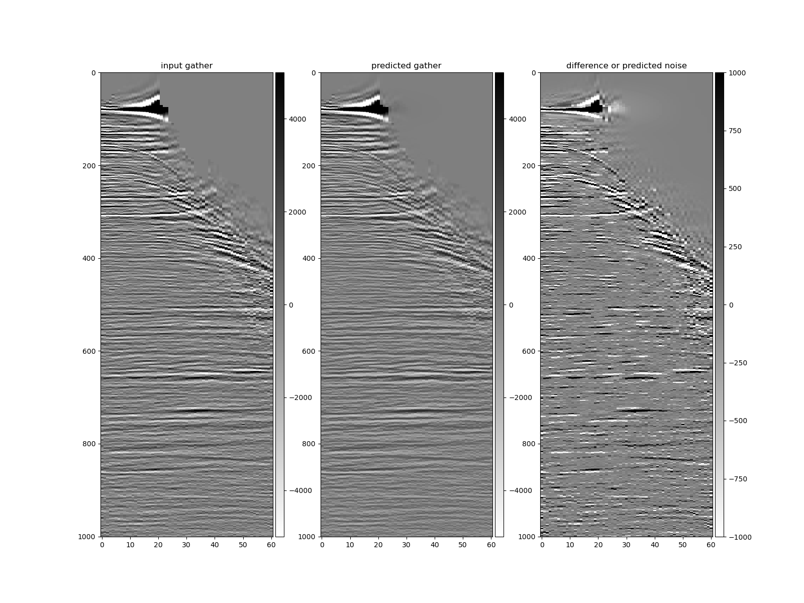

# barebones_seismic_deepconvnet
Skeleton framework for a deep convolutional neural network with seismic data.

## data
The data used for this experiment is from the Penobscot open source dataset on [dataunderground penobscot](https://dataunderground.org/dataset/penobscot). Ensembles (pre-stack time migrated gathers) were extracted and written to numpy binary files (`/data`) from the Penobscot 3D gathers segy files. To simplify the mapping of patches, only full fold gathers (61 traces per ensemble) were used for training, testing, and validation. No other processing or interpolation has been applied for this early simple experiment.

Due to the size of the files, the data has not been included in this repository. See [segytools](https://github.com/anthonytorlucci/segytools) and [segyio](https://github.com/equinor/segyio) for python libraries to parse segy files.

### torch dataset
The dataset and dataloader classes are defined in `patch_dset.py`. The dataset class inherits [pytorch dataset](https://pytorch.org/docs/stable/data.html#torch.utils.data.Dataset) with the primary purpose of sending "patches" to the network via the `__getitem__` call.

One of the challenges when working with multi-dimensional data that can easily exceed 10 or even 20 GB and trying to extract a small two-dimensional array (patch) is designing a method that is both memory efficient and physical disk space conservative. When the dataset attempts to load the entire volume of data, the batch size will be very limited and Out of Memory errors arise quickly. At the other extreme, one could write out each patch as a 2D array and lazy load, but 10 GB can easily fill a few TB with overlapping patches resulting large redundancies of repeated data. This example takes a middle ground approach where each CMP gather is written as a numpy `.npy` file, loaded, then a single patch is output upon each request. To acheive this, a mapping dictionary is created in which the key is an integer and the value is a tuple (ensemble_index, patch_start_fold, patch_start_samples). This mapping can be created outside the dataset using the static method 

```python
idx_map = PatchDataset.create_index_mapping(
  mode='train', 
  num_ensembles=NUM_ENSEMBLES, 
  max_fold=MAX_FOLD, 
  num_samples=NUM_SAMPLES, 
  patch_size=PATCH_SIZE)
```

which could also be passed to the PatchDataset for consistent hyper-parameter testing at a later stage.

### lightning dataloader
This experiment uses pytorch lightning 2.0 for training and uses the [LightningDataModule](https://lightning.ai/docs/pytorch/stable/data/datamodule.html) to feed the network. This is a very simple example that initialized the torch datasets and torch dataloaders.

## the network
The network is depthwise convolutional network similar to [U-Net](https://arxiv.org/abs/1505.04597) (Ronneberger, et al., 2015).

## applying to real data
After training the network, the DCN can be applied to a gather using a sliding window approach as shown in [apply_dcn.py](./apply_dcn.py). The result is shown below:



While there is clearly signal leakage, this "barebones" approach illustrates how to setup the training/application workflow and provides a good starting point for future work.

## discussion for future work
The work presented here is truly a barebones approach to generate a skeleton framework for future experimentation.

### hyper-parameter testing

### additional channels - attributes or spectral decomposition bands

### denoise DCN
